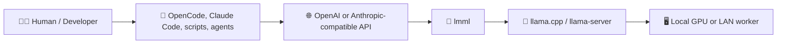
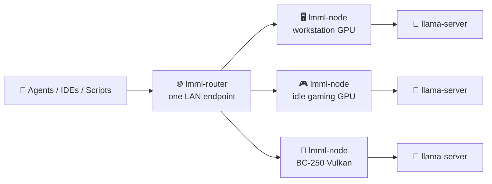
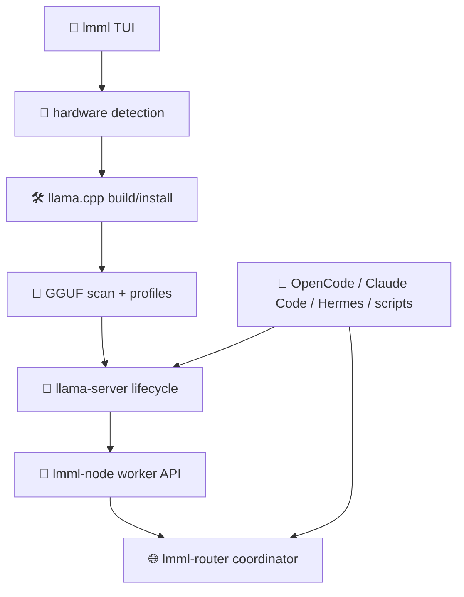

# lmml

<p align="center">
  <strong>🧭 Local Model Manager for llama.cpp</strong><br />
  Run local AI on the machines you already own.
</p>

<p align="center">
  <a href="LICENSE"></a>
  
  
  
</p>

**Local AI should be easier to own, inspect, and route.**

`lmml` helps developers, researchers, and small teams run GGUF models with
`llama.cpp` without hand-assembling hardware probes, build flags, runtime
profiles, model paths, OpenAI-compatible endpoints, and LAN routing.

It is an open-source Rust toolkit from SoulHash for local model operations:
hardware detection, `llama.cpp` builds, GGUF model management, server lifecycle,
agent/client wiring, LAN node APIs, and a lightweight router for multiple idle
GPU machines.

> **One-line value proposition:** `lmml` helps local-AI builders deploy and
> coordinate `llama.cpp` inference without fragile shell glue by using a
> hardware-aware TUI, tested runtime profiles, OpenAI/Anthropic-compatible
> adapters, and opt-in LAN worker discovery.



## 🧩 The Challenge

You are building with local models because ownership, latency, cost control, and
inspectability matter. The hard part is not usually one command; it is keeping
the whole path dependable:

- choosing the right backend for CUDA, ROCm/HIP, Vulkan, Metal, Intel, or CPU;
- compiling a recent `llama.cpp` build with the right flags;
- matching GGUF models to VRAM, context, KV cache, draft heads, and chat format;
- exposing a safe local endpoint for tools such as OpenCode, Claude Code,
  Hermes-style clients, scripts, and agents;
- using idle LAN GPUs without turning every workstation into a manual snowflake.

The common failure mode is hidden complexity: stale binaries, wrong GPU arch
flags, broken model templates, context settings that exhaust VRAM, missing auth
on LAN routes, and agent clients pointed at the wrong endpoint.

## 🛠️ The Solution

SoulHash built `lmml` as the guide layer around `llama.cpp`.

`lmml` does not replace `llama.cpp`; it makes the operational path repeatable.
It detects the machine, builds or installs the runtime, tracks local GGUF files,
starts `llama-server`, exposes compatibility APIs, and can coordinate multiple
LAN workers through `lmml-node` and `lmml-router`.

The customer owns the mission: run useful local AI infrastructure with control.
`lmml` supplies the leverage: sane defaults, clear diagnostics, and tested
integration paths.

## ✨ Why It Matters

Local AI should not require surrendering ownership to a remote platform or
memorising every `llama-server` flag by hand. With `lmml`, you can move from
"I have a GPU and a model file" to "I have a working local endpoint for humans,
scripts, and agents" with fewer undocumented assumptions.

The practical value is simple:

- **Developers** get a local OpenAI-compatible server for coding agents and
  automation.
- **Researchers** get a repeatable way to test GGUF models and llama.cpp
  features on real hardware.
- **Small teams** get a LAN-first path for using idle workstation GPUs before
  buying more infrastructure.
- **Operators** get explicit security boundaries: localhost by default, bearer
  auth for LAN worker/router APIs, and opt-in discovery.

## ✅ Current Status

`lmml` is **open source** and in **active development**.

Implemented and tested today:

- Rust TUI binary: `lmml`.
- Worker API binary: `lmml-node`.
- LAN routing binary: `lmml-router`.
- Linux x86_64 LAN install/release flow for v0.1.0.
- Source-build bootstrap for development and host-specific builds.
- OpenAI-compatible `/v1/chat/completions`, `/v1/embeddings`, and `/v1/models`
  pass-throughs.
- Anthropic `/v1/messages` compatibility endpoint through `lmml-node` and
  `lmml-router`.
- Model-family guidance for Qwen3.5, Qwen3.6, Gemma 4, and Hermes 4.
- Runtime profile support for validated Qwen, Gemma MTP, and BC-250 Vulkan
  scenarios.
- Opt-in LAN node discovery and authenticated router-to-worker probing.

Experimental or host-dependent:

- Native `llama.cpp` training workflows through `llama-finetune`.
- Gemma 4 MTP speculative decoding profiles, which require a matching draft
  model and recent `llama.cpp` support.
- Multimodal model operation, which requires the correct `mmproj` file and
  validated client routing.
- Non-Linux release artifacts until built and tested on matching hosts.

Not part of this project:

- No proprietary SoulHash or AgentQ engine code.
- No quantum technology claims or quantum-specific implementation.
- No bundled model weights.

## 🚀 Core Capabilities

**🧭 Hardware-aware setup:** Detects GPU, CPU, OS, compiler, and runtime tools so
you can build or install `llama.cpp` with fewer architecture mismatches.

**🖥️ TUI-driven local operations:** Gives humans a terminal interface to detect,
build, scan models, start/stop the server, inspect logs, and switch profiles.

**🧠 GGUF model management:** Scans local model directories, tracks aliases, reads
basic metadata, and maps known model families to safer runtime guidance.

**🔌 Agent-ready serving:** Runs local `llama-server` endpoints for OpenCode,
Claude Code, Hermes-style clients, shell scripts, and OpenAI-compatible tools.

**💬 Anthropic compatibility:** Adds `/v1/messages` translation for clients that
speak Anthropic-style Messages APIs while your backend remains `llama.cpp`.

**🌐 LAN worker routing:** Lets one coordinator route requests across authenticated
`lmml-node` workers, including opt-in multicast discovery for idle GPU machines.

**⚙️ Runtime profiles:** Stores repeatable profile settings for context size,
parallelism, GPU layers, KV cache, draft-model flags, sampling, and server args.

**🧪 Training command support:** Wraps current upstream `llama-finetune` behavior
without pretending unsupported flags such as `--lora-out` exist unless the local
binary advertises them.

## 🧭 How It Works

1. **Start:** Install `lmml`, or build it from source.
2. **Activate:** Run the TUI, build/probe `llama.cpp`, scan GGUF models, and
   start a local server.
3. **Advance:** Wire coding agents or LAN workers to the local endpoint, then
   route requests through `lmml-node` or `lmml-router` as your setup grows.

## ⚡ Quick Start

### Build From Source

```sh
git clone https://github.com/soulhash-labs/lmml.git
cd lmml
cargo build --release -p lmml-tui -p lmml-node -p lmml-router
./target/release/lmml doctor
./target/release/lmml
```

### Binary Or LAN Install

The release package includes `lmml`, `lmml-node`, `lmml-router`, `install.sh`,
`preflight.sh`, and `uninstall.sh`.

Serve the `dist/` directory from a trusted LAN release host:

```sh
cd dist
python3 -m http.server 8000
```

Install from another LAN machine:

```sh
curl -fsSL http://192.168.1.100:8000/install.sh | BASE_URL=http://192.168.1.100:8000 sh
```

Run after install:

```sh
lmml doctor
lmml
```

The LAN HTTP flow verifies `SHA256SUMS` for corruption detection. For untrusted
networks or public releases, require signed checksum verification:

```sh
curl -fsSL https://release.example/install.sh | \
  LMML_CHECKSUM_VERIFY=required \
  LMML_MINISIGN_PUBLIC_KEY='RW...' \
  sh
```

### Source-Build Bootstrap

Use source mode when the target machine must build `llama.cpp` locally, such as
Vulkan-only or unusual GPU hosts:

```sh
curl -fsSL http://192.168.1.100:8000/preflight.sh | LMML_INSTALL_MODE=source bash
curl -fsSL http://192.168.1.100:8000/install.sh | \
  BASE_URL=http://192.168.1.100:8000 \
  INSTALL_MODE=source \
  bash
```

For intentional CPU-only nodes:

```sh
curl -fsSL http://192.168.1.100:8000/preflight.sh | \
  LMML_INSTALL_MODE=source \
  LMML_GPU_MODE=cpu-only \
  bash
```

## 🔌 Agent And Client Wiring

### OpenCode

OpenCode is the first-class local coding harness target. Keep the TUI-managed
server on port `1200` and point OpenCode at the OpenAI-compatible base URL:

```text
baseURL: http://127.0.0.1:1200/v1
model: llamacpp/<your-gguf-model-name>
```

Let `lmml` write the provider block:

```sh
lmml runtime configure opencode --base-url http://127.0.0.1:1200/v1
```

Quick verification:

```sh
curl -fsS http://127.0.0.1:1200/health
curl -fsS http://127.0.0.1:1200/v1/models
opencode models llamacpp
```

### Claude Code

Claude Code can use `lmml-node` through the Anthropic Messages compatibility
endpoint. Keep `llama-server` on port `1200`, then start the adapter:

```sh
LMML_NODE_API_KEY=local-dev-key lmml-node --llama-url http://127.0.0.1:1200
```

In the Claude Code shell:

```sh
export ANTHROPIC_BASE_URL=http://127.0.0.1:8101
export ANTHROPIC_AUTH_TOKEN=local-dev-key
export ANTHROPIC_MODEL=Qwen3.5-4B-Q8_0.gguf
export ANTHROPIC_SMALL_FAST_MODEL=Qwen3.5-4B-Q8_0.gguf
claude
```

Request path:

```text
Claude Code -> /v1/messages -> lmml-node -> llama-server /v1/chat/completions
```

### Hermes-Style Clients

Hermes-style OpenAI-compatible clients can target any `lmml` OpenAI-compatible
base URL:

```text
base URL: http://127.0.0.1:1200/v1
model: <your Hermes or other GGUF filename>
```

`lmml` also recognizes Hermes 4 GGUF names and displays family-specific guidance
where available. Recognition is not the same as a tuned runtime profile; keep
Hermes profiles explicit and hardware-validated.

## 🌐 LAN Routing And Idle Workstations

A LAN setup has two layers:

- `lmml-node`: exposes one machine as an authenticated worker API in front of a
  local `llama-server`.
- `lmml-router`: exposes one coordinator URL and routes requests across ready
  workers by route support, requested model, and current load metadata.



Static example:

```sh
# Worker beside a TUI-managed llama-server on port 1200.
LMML_NODE_API_KEY=worker-key lmml-node \
  --host 0.0.0.0 \
  --port 8101 \
  --node-name workstation \
  --llama-url http://127.0.0.1:1200

# Coordinator router.
LMML_ROUTER_API_KEY=router-key lmml-router \
  --host 0.0.0.0 \
  --port 8100 \
  --upstream workstation=http://192.168.50.178:8101 \
  --upstream-key workstation=worker-key
```

Point clients at the router:

```text
OpenAI-compatible base URL: http://<router-ip>:8100/v1
Anthropic-compatible base URL: http://<router-ip>:8100
```

Opt-in LAN discovery:

```sh
LMML_NODE_API_KEY=worker-key lmml-node \
  --host 0.0.0.0 \
  --port 8101 \
  --public-url http://192.168.50.178:8101 \
  --advertise-lan

LMML_ROUTER_API_KEY=router-key lmml-router \
  --host 0.0.0.0 \
  --port 8100 \
  --discover-lan \
  --upstream-key default=worker-key
```

Advertisements are hints, not trust. The router only uses a discovered worker
after authenticated health, capability, and load probes pass.

## 🧠 Model Family Guidance

`lmml` includes model-family guidance, not model weights.

### Qwen3.5 And Qwen3.6

Qwen profiles focus on long-context coding and agent workloads. `lmml` includes
safeguards for known Qwen runtime issues, including raw reasoning output when
needed, KV cache quantization guidance for large context, and profile-specific
context/parallelism settings.

Supported catalog families include small Qwen variants and larger Qwen3.6
variants such as 27B and 35B-A3B-style MoE profiles where the hardware and GGUF
files are available.

### Gemma 4

Gemma 4 support includes QAT-oriented guidance and an MTP profile for speculative
decoding when a matching draft head is available:

```text
gemma4-12b-mtp-q4km:
  model: Gemma4-12B-QAT-Q4_K_M.gguf
  draft: mtp-gemma-4-12B-it.gguf
  args: -md <draft> --spec-type draft-mtp -fa on
  sampling: temperature=0.6 top_k=64 top_p=0.9 min_p=0.05 repeat_penalty=1.1
```

### BC-250 Vulkan Nodes

Headless AMD BC-250 machines can run as LAN workers with source-built Vulkan
support:

```sh
curl -fsSL http://192.168.1.100:8000/install.sh | \
  BASE_URL=http://192.168.1.100:8000 \
  INSTALL_MODE=source \
  LMML_GPU_MODE=vulkan \
  LMML_PROFILE_HINT=bc250-qwen35-9b-q4km-vulkan \
  sh
```

## 🧪 Native llama.cpp Training

`lmml train` is an experimental wrapper around native `llama.cpp` training
binaries. It does not run a Python/PyTorch fine-tuning stack.

Current upstream `llama-finetune` behavior is treated as full-model GGUF
fine-tuning. `lmml` maps common intent flags to the local binary’s advertised
capabilities and only enables custom-fork flags such as `--lora-out` when
`llama-finetune --help` explicitly reports support.

Example:

```sh
lmml train \
  --model-base ./models/Qwen3.5-9B-BF16.gguf \
  --train-data ./data/train.txt \
  --output ./models/Qwen3.5-9B-Finetuned.gguf \
  -- --epochs 3 --ctx-size 512 --batch-size 4 --n-gpu-layers 32
```

Use F16/BF16 bases for training and quantize the output GGUF afterward.

## 🏗️ Architecture



Workspace crates:

- `lmml-api` — shared API DTOs and version constants.
- `lmml-build` — `llama.cpp` clone/configure/build pipeline.
- `lmml-compat` — `llama-server` flag compatibility probing.
- `lmml-detect` — hardware and toolchain detection.
- `lmml-models` — GGUF scanning, aliases, and model catalog guidance.
- `lmml-node` — worker API in front of a local `llama-server`.
- `lmml-router` — LAN coordinator and load router.
- `lmml-server` — local server lifecycle management.
- `lmml-state` — config/state/runtime profile persistence.
- `lmml-tui` — terminal UI and CLI entrypoint.

## 📚 Documentation

- [How to use lmml](docs/how-to-use.md)
- [LAN client install guide](docs/lan-client-install.md)
- [Training guide](docs/training-how-to-use.md)
- [GPU support catalog](docs/hardware-gpu-support.md)
- [LLM model support catalog](docs/llm-model-support.md)
- [Runtime harness plan](docs/runtime-harness-plan.md)
- [Release checklist](docs/release-checklist.md)
- [Integration contract](docs/lmml-integration-contract.md)

## 🧑‍💻 Development

Prerequisites:

```sh
rustup update stable
```

Common commands:

```sh
cargo fmt --all -- --check
cargo test --workspace
cargo clippy --workspace -- -D warnings
cargo build --release -p lmml-tui -p lmml-node -p lmml-router
```

Package a release:

```sh
scripts/package-release.sh
```

Run the TUI from source:

```sh
cargo run -p lmml-tui
```

## 🔐 Security Model

- Localhost is the default serving posture.
- LAN binds require bearer auth unless an explicit unsafe development escape
  hatch is used.
- `lmml-node` and `lmml-router` require authenticated non-health routes.
- LAN discovery is opt-in and advertisements are verified before routing.
- LAN HTTP installer checksums detect corrupt downloads; signed checksum
  verification is required for untrusted distribution.
- Model weights are not bundled.

Please do not report private credentials in public issues. If this repository
adds a dedicated security contact, use that path for sensitive reports.

## 🤝 Contributing

Contributions are useful when they improve a tested path:

- hardware probe fixtures for more GPUs and drivers;
- runtime profiles with clear model, quant, context, and VRAM evidence;
- compatibility tests for `llama.cpp` flag changes;
- docs that separate validated behavior from planned behavior;
- LAN routing and agent-client integration tests.

Before opening a pull request, run:

```sh
cargo fmt --all -- --check
cargo test --workspace
cargo clippy --workspace -- -D warnings
```

## 📄 License

Apache-2.0. See [LICENSE](LICENSE).

## ⭐ Call To Action

Clone the repository, run `lmml doctor`, and try the TUI against one local GGUF
model. If it helps you turn an idle GPU into a dependable local-AI endpoint,
star the repo and contribute the hardware/profile evidence back.

**Purpose:** `lmml` exists so advanced local AI remains open, inspectable, and
controlled by the people running it.
