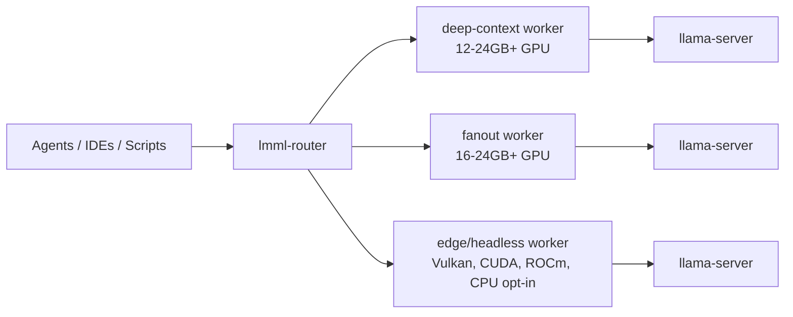

# lmml Fleet Profile Reference

`lmml` can run on one workstation or across a LAN of GPU machines. Fleet
profiles describe how to divide local inference work between deep-context
sessions, multi-agent fanout, and low-cost headless workers without pretending
one `llama-server` process can do every job well at once.

This document is public guidance. It uses generic hardware tiers and labels each
profile as either **validated**, **proposed**, or **experimental**.

## Operating Principle

Do not mix deep-context single-agent mode and high-parallel fanout in the same
`llama-server` instance. They optimize for different bottlenecks:

- **Deep mode:** one long-lived coding/research agent with the largest practical
  context window.
- **Fanout mode:** multiple smaller agent requests with controlled per-slot
  context.
- **Headless node mode:** a worker appliance on the LAN with a narrow, reliable
  model profile.

Use separate `lmml` runtime profiles, or separate machines, for these roles.

## Fleet Topology



## Validation Labels

| Label | Meaning |
|---|---|
| **Validated** | Tested on real hardware with server health, model metadata, load behavior, and a decode request. |
| **Proposed** | Derived from VRAM/context math and known llama.cpp behavior, but not yet load-tested on the exact target. |
| **Experimental** | Useful for exploration, but needs profiling before agent automation depends on it. |

Do not advertise a profile as validated until it has evidence from the target
machine and model.

## Profile Families

### 1. Deep Context Worker

Purpose: one primary agent with a large repository or research context.

Recommended shape:

```toml
[profiles.deep-context]
ctx_size = 262144
parallel_slots = 1
compaction_reserved = 65536
batch_size = 512
ubatch_size = 128
kv_cache_type_k = "q8_0"
kv_cache_type_v = "q8_0"
cache_ram_mb = 4096
prompt_cache = "disk"
```

Operational envelope:

| Zone | Live prompt size | Action |
|---|---:|---|
| Green | 0-120k tokens | Normal long-context work. |
| Yellow | 120k-170k tokens | Monitor latency and memory pressure. |
| Red | 170k-196k tokens | Compact soon; expect slower turns. |
| Hard cap | above 196k tokens | Compact, summarize, or reject. |

Notes:

- `parallel_slots = 1` is intentional.
- Subagents should be serialized or routed to another worker.
- Long-context profiles need KV cache quantization on memory-constrained GPUs.
- Use the model's embedded chat template unless a profile-specific override has
  been tested with that exact GGUF.

Status: **validated pattern**, hardware-specific values still require local
validation.

### 2. Balanced Fanout Worker

Purpose: a GPU worker that handles multiple agent/subagent requests with bounded
per-slot context.

Recommended shape for a 16-24GB class GPU:

```toml
[profiles.balanced-fanout]
ctx_size = 131072
parallel_slots = 2
compaction_reserved = 32768
batch_size = 512
ubatch_size = 128
kv_cache_type_k = "q8_0"
kv_cache_type_v = "q8_0"
prompt_cache = "disk"
```

Recommended shape for aggressive fanout:

```toml
[profiles.kv-unified-fanout]
ctx_size = 65536
parallel_slots = 4
compaction_reserved = 16384
batch_size = 512
ubatch_size = 128
kv_unified = true
kv_cache_type_k = "q4_0"
kv_cache_type_v = "q4_0"
```

Rules:

- Increase `parallel_slots` only after proving per-slot context and VRAM headroom.
- For 4+ concurrent slots, prefer smaller total context plus `--kv-unified` when
  supported by the local `llama-server` build.
- Route background agents here instead of sharing a single deep-context process.

Status: **proposed**, validate per GPU/model combination.

### 3. Headless LAN Worker

Purpose: a small server or appliance that contributes one reliable model lane to
a LAN router.

Recommended shape:

```toml
[profiles.headless-lan-worker]
host = "0.0.0.0"
port = 8080
ctx_size = 4096
gpu_layers = 99
parallel_slots = 1
threads = 6
backend = "vulkan"
```

Typical use cases:

- Vulkan/RADV AMD appliance-style nodes.
- Older CUDA nodes with a conservative quantized model.
- CPU-only fallback nodes when explicitly opted in.

Status: **proposed**, validate boot-time service behavior and LAN auth.

## Model Assignment

| Model class | Best fit | Notes |
|---|---|---|
| 4B Q8 | Deep mode on 11-16GB GPUs | Good for local coding agents with large context. |
| 9B Q4/Q8 | 16-24GB GPUs | Q4 for headroom, Q8 for quality when VRAM allows. |
| 12B QAT Q4 + MTP | 16GB+ GPUs | Requires matching draft model for MTP speculative decoding. |
| 27B/35B MoE Q4 | 24GB+ or multi-node routing | Validate memory, context, and throughput before automation. |

For Qwen-family thinking workloads, maintain at least 128k context when the goal
is long reasoning. For high-concurrency agent fanout, reduce per-slot context and
route deeper tasks to a dedicated deep-context lane.

## LAN Routing

Run one `lmml-node` per worker and one `lmml-router` as the coordinator:

```sh
LMML_NODE_API_KEY=worker-key lmml-node \
  --host 0.0.0.0 \
  --port 8101 \
  --node-name deep-worker \
  --llama-url http://127.0.0.1:1200

LMML_ROUTER_API_KEY=router-key lmml-router \
  --host 0.0.0.0 \
  --port 8100 \
  --upstream deep-worker=http://192.168.1.101:8101 \
  --upstream-key deep-worker=worker-key
```

Opt-in LAN discovery can replace static upstream lists:

```sh
LMML_NODE_API_KEY=worker-key lmml-node \
  --host 0.0.0.0 \
  --port 8101 \
  --public-url http://192.168.1.101:8101 \
  --advertise-lan

LMML_ROUTER_API_KEY=router-key lmml-router \
  --host 0.0.0.0 \
  --port 8100 \
  --discover-lan \
  --upstream-key default=worker-key
```

Advertisements are only hints. The router must verify workers through
authenticated health, capability, model, and load probes before routing.

## OpenCode / Agent Context Policy

Use context budgets that reflect the runtime profile:

| Worker type | Suggested max subagents | Practical per-agent target |
|---|---:|---:|
| Deep context | 0-1 | 90k-170k live prompt tokens |
| Balanced fanout | 1-2 | 32k-80k tokens |
| Aggressive fanout | 3-8 | 8k-24k tokens |
| Headless worker | 0-1 | 2k-8k tokens |

These are operating targets, not hard mathematical guarantees. Effective limits
change with model size, quantization, KV cache type, llama.cpp build, GPU memory,
CPU RAM, and prompt-cache behavior.

## Validation Checklist

Before marking a fleet profile validated:

1. Run `lmml doctor` on the worker.
2. Start the profile through the TUI or runtime CLI.
3. Confirm `GET /health` or `/v1/health` succeeds.
4. Confirm `GET /v1/models` reports the intended GGUF.
5. Run one short decode request.
6. Run one request near the intended context budget.
7. Watch server logs for KV OOM, cache spill, slot truncation, and timeout signs.
8. Record GPU, VRAM, model, quantization, context, parallelism, and throughput.
9. Only then promote the profile from proposed to validated.

## Public Profile Policy

Public profiles should use generic names and clear validation status:

```text
validated-12gb-qwen4b-deep
proposed-16gb-qwen4b-fanout4
proposed-24gb-qwen9b-balanced2
experimental-vulkan-qwen9b-headless
```

Avoid site-specific machine names in public docs. Keep local fleet names,
hostnames, IP addresses, logs, and private evidence snapshots outside the public
repository.
