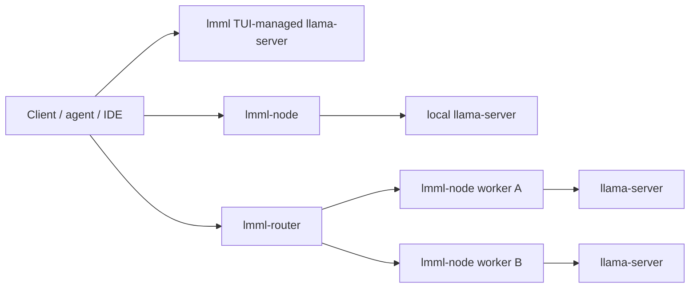

# lmml Integration Contract

This document defines the public integration boundary for `lmml` as a local
`llama.cpp` operations layer. It is intended for developers building clients,
agents, wrappers, LAN worker setups, and compatibility tooling around `lmml`.

The contract separates three concerns:

1. **Local runtime management:** `lmml` builds, configures, and supervises
   `llama-server`.
2. **Worker API:** `lmml-node` exposes one machine as an authenticated HTTP
   worker in front of a local `llama-server`.
3. **LAN coordination:** `lmml-router` exposes one coordinator URL and routes
   requests across ready workers.

## Status

| Area | Status |
|---|---|
| TUI-managed local `llama-server` | Implemented |
| OpenAI-compatible llama.cpp serving | Implemented through `llama-server` |
| `lmml-node` health/capabilities/load/models | Implemented |
| `lmml-node` `/v1/infer` | Implemented |
| `/v1/chat/completions` passthrough | Implemented |
| `/v1/embeddings` passthrough | Implemented |
| Anthropic `/v1/messages` compatibility | Implemented |
| `lmml-router` static upstream routing | Implemented |
| `lmml-router` opt-in LAN discovery | Implemented |
| Server control through node APIs | Gated, disabled by default |
| Native llama.cpp training wrapper | Experimental |

Anything outside this table should be treated as planned or experimental unless
the relevant code path and tests say otherwise.

## Topology



Clients may connect directly to:

- `llama-server` when only OpenAI-compatible local serving is needed.
- `lmml-node` when a single machine should expose the LMML worker API.
- `lmml-router` when requests should be routed across multiple workers.

## Security Boundary

Default posture:

- `lmml` serves on localhost unless configured otherwise.
- `lmml-node` and `lmml-router` require bearer auth for LAN-visible non-health
  routes.
- Server-control APIs are disabled by default and require explicit opt-in plus
  an API key.
- LAN discovery is opt-in. Advertisements are treated as hints and must pass
  authenticated probes before routing.

Authentication examples:

```sh
LMML_NODE_API_KEY=worker-key lmml-node --host 0.0.0.0 --port 8101
LMML_ROUTER_API_KEY=router-key lmml-router --host 0.0.0.0 --port 8100
```

Client header:

```text
Authorization: Bearer <key>
```

For Anthropic-compatible clients, `x-api-key` is also accepted where applicable.

## Runtime Profile Contract

Runtime profiles describe how `lmml` should launch `llama-server`.

Public profile fields should remain generic and portable:

```toml
[profiles.example]
name = "example"
model = "~/.local/share/lmml/models/model.gguf"
host = "127.0.0.1"
port = 1200
ctx_size = 65536
gpu_layers = -1
batch_size = 512
ubatch_size = 128
threads = 8
parallel = 1
kv_cache_type_k = "q8_0"
kv_cache_type_v = "q8_0"
cache_ram_mb = 0
extra_args = []
```

Profile rules:

- `ctx_size` must leave enough room for client compaction and generation.
- `parallel` must match the intended workload. Use `1` for deep-context work and
  multiple slots only for bounded fanout.
- KV cache quantization should be explicit for long-context profiles.
- `extra_args` are appended after LMML-owned args but should not duplicate them.
- Model-family overrides must be tied to a specific model/profile, not applied
  globally.

## Context Guard

For clients with compaction or reserved context, the basic guard is:

```text
ctx_size >= compaction_reserved + generation_buffer
```

Recommended default:

```text
generation_buffer = 4096 tokens
```

Example:

```text
ctx_size = 65536
compaction_reserved = 16384
generation_buffer = 4096

65536 >= 16384 + 4096  => OK
```

If a profile cannot satisfy this guard, `lmml` should warn or reject the profile
before the client hits context exhaustion at runtime.

## VRAM Budget Guard

Long-context serving is constrained by:

- model weights;
- KV cache;
- graph/workspace overhead;
- prompt cache behavior;
- GPU backend support;
- available CPU RAM when host cache/spill is enabled.

Public guidance:

- Prefer `q8_0` KV for quality-preserving long context when VRAM permits.
- Prefer `q4_0` key/value KV only for aggressive fanout after profiling.
- Use `--kv-unified` only when the local `llama-server` build supports it.
- Use `--flash-attn` only when supported by the target backend/GPU.

Any profile that claims a specific VRAM fit should document:

```text
GPU model/class:
VRAM:
model GGUF:
quantization:
ctx_size:
parallel:
KV cache type:
observed server health:
observed decode result:
```

## `lmml-node` API

Default address:

```text
http://127.0.0.1:8101
```

Public route summary:

| Route | Auth | Purpose |
|---|---:|---|
| `GET /health` | No | Basic node health. |
| `GET /v1/capabilities` | Yes | Route and feature support. |
| `GET /v1/load` | Yes | Readiness/load metadata. |
| `GET /v1/models` | Yes | Local model inventory. |
| `POST /v1/infer` | Yes | Stable LMML inference request. |
| `POST /v1/chat/completions` | Yes | Raw OpenAI-compatible passthrough. |
| `POST /v1/embeddings` | Yes | Raw OpenAI-compatible passthrough. |
| `POST /v1/messages` | Yes | Anthropic Messages compatibility. |
| `POST /v1/server/control` | Yes | Gated server-control route. |

The node must authorize before parsing request bodies on protected routes.

## `/v1/infer`

`/v1/infer` is the stable LMML request surface for normalized inference.

Request shape:

```json
{
  "request_id": "optional-client-id",
  "prompt": "Explain the repository structure.",
  "model": "optional-model-id",
  "task_type": "general",
  "metadata": {}
}
```

Response shape:

```json
{
  "request_id": "optional-client-id",
  "model": "model.gguf",
  "output": "Response text",
  "finish_reason": "stop",
  "usage": {
    "prompt_tokens": 128,
    "completion_tokens": 64,
    "total_tokens": 192
  }
}
```

Rules:

- Empty prompts are rejected with structured errors.
- Caller `request_id` is preserved when provided.
- A request ID is assigned when absent.
- Upstream timeouts and non-2xx responses are mapped to LMML error responses.

## Compatibility Routes

Compatibility routes intentionally preserve upstream JSON where practical:

- `/v1/chat/completions`
- `/v1/embeddings`

These routes are best for existing OpenAI-compatible clients. New LMML-native
integrations should prefer `/v1/infer` unless they need exact passthrough
behavior.

## Anthropic Messages Compatibility

`POST /v1/messages` lets Anthropic-style clients talk to a local `llama.cpp`
backend through `lmml-node` or `lmml-router`.

Supported behavior:

- maps text messages to OpenAI-compatible chat completions;
- maps tool schemas to OpenAI-style function tools;
- maps OpenAI tool calls back to Anthropic `tool_use` blocks;
- synthesizes Anthropic-style server-sent events for streaming requests.

Unsupported behavior:

- image/document content blocks until multimodal routing is validated;
- vendor-specific remote Anthropic features that do not exist in `llama.cpp`.

## `lmml-router`

Default address:

```text
http://127.0.0.1:8100
```

Static upstream example:

```sh
LMML_ROUTER_API_KEY=router-key lmml-router \
  --host 0.0.0.0 \
  --port 8100 \
  --upstream worker-a=http://192.168.1.101:8101 \
  --upstream worker-b=http://192.168.1.102:8101 \
  --upstream-key worker-a=worker-key \
  --upstream-key worker-b=worker-key
```

Discovery example:

```sh
LMML_ROUTER_API_KEY=router-key lmml-router \
  --host 0.0.0.0 \
  --port 8100 \
  --discover-lan \
  --upstream-key default=worker-key
```

Routing rules:

- Static upstreams win over discovered upstreams on name collisions.
- A worker is routable only after health, capabilities, load, and auth checks.
- Degraded workers are not used for aggregate capabilities/models/load.
- Model-specific requests should route to workers advertising the requested
  model when possible.
- Least-loaded ready workers are preferred for generic requests.

## LAN Advertisement Contract

`lmml-node --advertise-lan` sends signed-by-context JSON advertisements over UDP
multicast. The advertisement is not an authentication mechanism.

Minimum safe advertisement requirements:

- node APIs must require auth;
- `--public-url` must be routable by other LAN machines;
- capabilities must report `auth_required = true`;
- router must have a matching upstream key before routing.

Example:

```sh
LMML_NODE_API_KEY=worker-key lmml-node \
  --host 0.0.0.0 \
  --port 8101 \
  --public-url http://192.168.1.101:8101 \
  --advertise-lan
```

## Server Control Contract

Server control is intentionally conservative.

Rules:

- disabled by default;
- requires bearer auth even on localhost;
- must not spawn arbitrary processes from node request bodies;
- lifecycle actions must delegate to LMML server-management code;
- unavailable server managers must return structured errors.

Recommended deployment:

```sh
LMML_NODE_API_KEY=worker-key lmml-node \
  --enable-server-control \
  --llama-url http://127.0.0.1:1200
```

Only enable this on trusted networks.

## Client Integration Checklist

For OpenAI-compatible clients:

1. Use `http://127.0.0.1:1200/v1` for direct TUI-managed serving.
2. Use `http://<node-ip>:8101/v1` for a single worker API.
3. Use `http://<router-ip>:8100/v1` for LAN routing.
4. Set request timeouts high enough for long-context prefill.
5. Keep model IDs aligned with `/v1/models`.

For Anthropic-compatible clients:

1. Use `http://<node-ip>:8101` or `http://<router-ip>:8100` as the base URL.
2. Set the auth token to the LMML bearer key.
3. Use text/tool requests only until multimodal support is validated.

For agent frameworks:

1. Send stable `request_id` values.
2. Preserve task metadata in `metadata`.
3. Respect node/router load state.
4. Route high-context tasks to deep profiles.
5. Route parallel background work to fanout profiles.

## Error Contract

LMML structured errors should include:

```json
{
  "error": {
    "code": "upstream_timeout",
    "message": "upstream llama-server timed out",
    "request_id": "optional-client-id"
  }
}
```

Common error codes:

| Code | Meaning |
|---|---|
| `unauthorized` | Missing or invalid bearer key. |
| `invalid_json` | Request body could not be parsed. |
| `invalid_request` | Request parsed but failed validation. |
| `upstream_error` | llama-server returned non-2xx. |
| `upstream_timeout` | Upstream request timed out. |
| `no_routable_upstream` | Router has no ready worker for the request. |
| `server_control_disabled` | Server-control API is not enabled. |

## Validation Checklist

Before declaring an integration ready:

1. Run `cargo test --workspace`.
2. Run `cargo clippy --workspace -- -D warnings`.
3. Confirm the target `llama-server` binary supports required flags.
4. Confirm `/health` and `/v1/models`.
5. Run one short request through the exact client path.
6. Run one long-context request near the intended budget.
7. Confirm auth failures happen before body parsing on protected routes.
8. Confirm router aggregation excludes degraded workers.
9. Confirm logs do not expose bearer keys or local private paths.

## Public Documentation Rule

Public integration docs should use:

- generic machine names;
- generic LAN IPs such as `192.168.1.101`;
- sanitized paths such as `~/.local/share/lmml`;
- explicit validated/proposed/experimental labels.

Keep local hostnames, private fleet names, raw session logs, and unsanitized
evidence snapshots outside the public repository.
